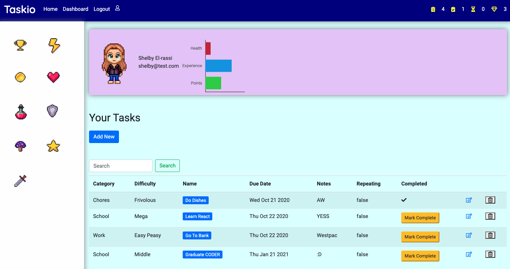
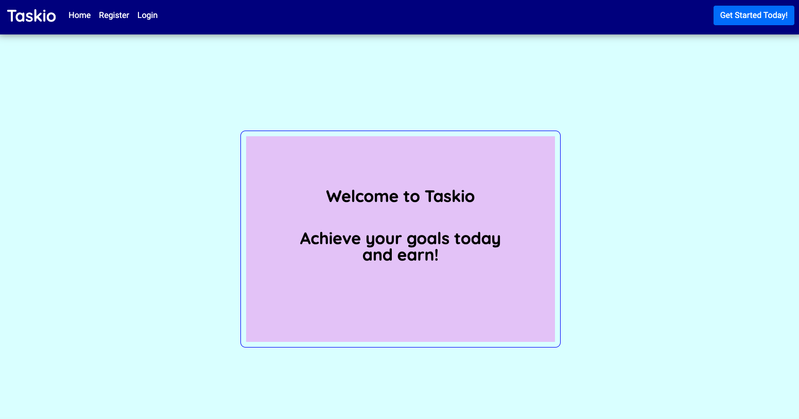
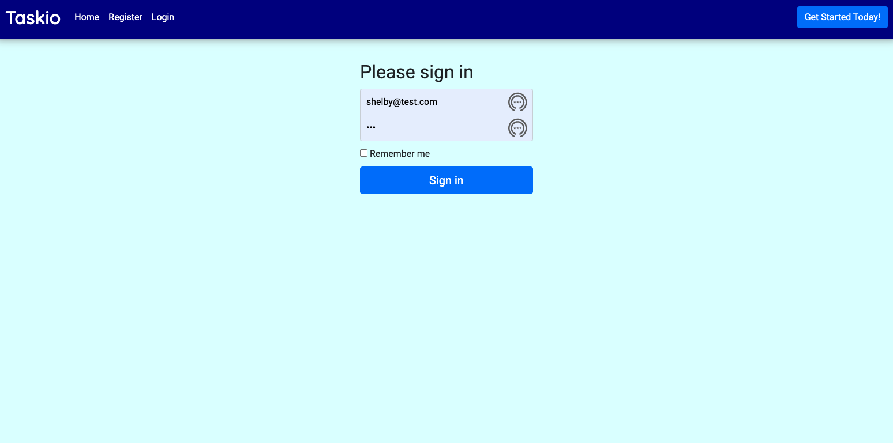
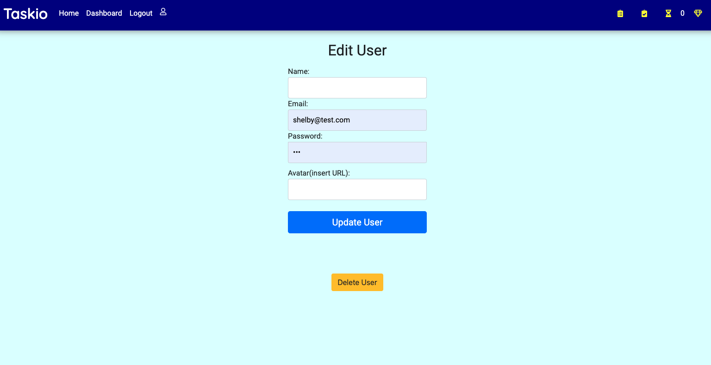
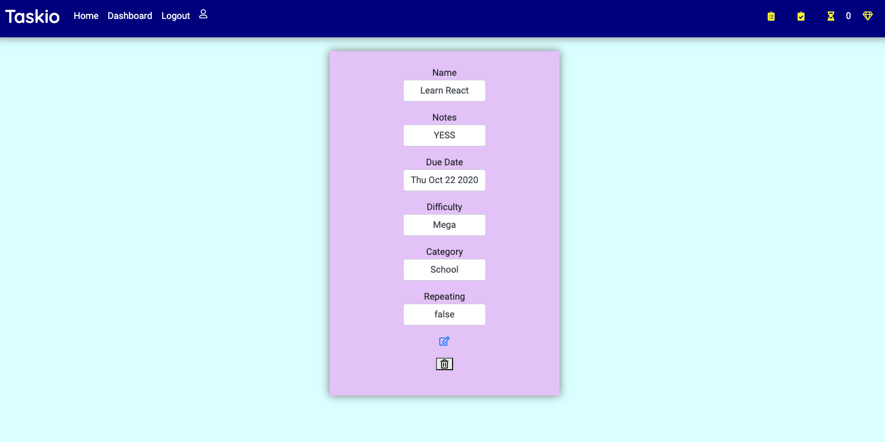

# Taskio

### Alex Qiang & Shelby El-rassi, Flex-track 2020, Express Hackathon

-----

* [Task App]( https://sleepy-falls-92191.herokuapp.com/home) - Live website

* [Github](https://github.com/Shelby219/express_hackathon) - Github repository

-----

## Problem it Solves

- The app is made to simplify our daily tasks schedule and build good habits.
- A gamified version just adds a modern-day fun spin on a standard task tracker.
- We at Taskio believe in the power of setting good goals and pushing ourselves forward.

## Initial Idea

Everyday Task Tracker with a gamified twist. When the need for keeping task lists is present, however earning points is extra incentive for completion. 

## Description

Taskio is your task tracking friend with a kick of motivation of earning points! 

### Current Features

- User can Register and Login (and
remember user)
- User can add their name and avatar
through edit user
- View User Dashboard (authenticated)
- Add new tasks, edit and delete
- Mark Tasks as Completed which
accumulates points.
- View Total Points on Dashboard.
- View total and completed task tally on
nav bar.

### Future Features

- Health and Ability Earnings via the ChartJS.
- Implement Reward Shopping (the pixel art)
- Advance Task functions, future dating,repeating, category sorting.
- Advanced User account details.
- Profile image upload file. Oauth with account access.
- Show total tasks that are getting close to due date(the timer in the nav bar).
- Search task function.

### Tech Stack

- JavaScript
- MongoDb
- Express JS
- Node JS
- Mongoose
- Pug JS
- Chart JS
- HTML
- CSS
- Postman
- Node Packages
    - Express
    - Cors
    - Mongoose
    - Passport
    - Pug
    - Passport-remember-me
    - Express-session
    - Connect-Mongo
    - Method-override
    - Path
- Trello
- Google Docs
- Figma 

### Challenges

- Setting up a remember me with passport-remember-me.
- The processing of DELETE and PUT routes.
- Handlebars EW, so pug JS was used for rendering.
- Updating task and user was wiping data all the data.
- Not going overboard with too many features we wanted in the short time.
- Stronger focus on error handling for future.
- Automated testing focus next time. We used manual testing this time.
- Console logging EERRRRYthing is key.

### Planning

#### Trello Planning 

#### Initial Notes

#### Wireframe

#### GitWorkflow
- Main Repository, created on Shelby’s Github.
- Alex forked from the created repo.
- We both used branches for current features/work we were working on.
- Then once happy with the branch, we pulled latest from main.
- Then made a pull request to merge with main.
- Workflow was smooth and merge conflicts were resolved with ease.

### Screen Shots

