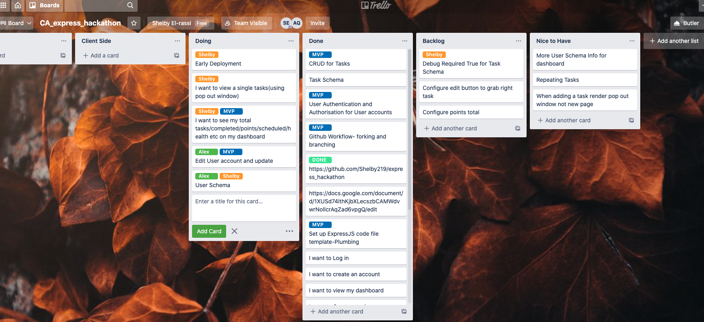
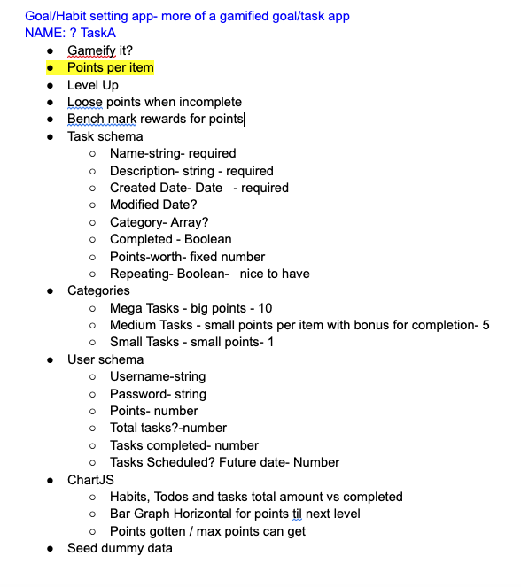

# Taskio

### Alex Qiang & Shelby El-rassi, Flex-track 2020, Express Hackathon

-----

* [Task App]( https://sleepy-falls-92191.herokuapp.com/) - Live website

* [Github](https://github.com/Shelby219/express_hackathon) - Github repository

-----

## Problem it Solves

List making, note taking reminders and scribbles are common with a lot of people. Whilst just another list/task tracking app is an ok idea, a gamified version just adds a modern day fun spin on a standard task tracker.

## Initial Idea

Everyday Task Tracker with a gamified twist. When the need for keeping task lists is present, however earning points is extra incentive for completion. 

## Description

Taskio is your task tracking friend with a kick of motivation of earning points! 

### Current Features

- User Register and Login
- User can add their name and avatar
- View User Dashboard (authenticated)
- Add new tasks, edit and delete
- Mark Tasks as Completed which accumulates points
- View Total Points on Dashboard
- View total and completed task tally on nav bar

### Future Features

- Health and Ability Earnings
- Implement Reward Shopping
- Advance Task functions, future dating, repeating, categories.
- Advanced User account details
- Profile image upload file
- Oauth with account access
- Show total tasks that are getting close to due date 

### Tech Stack

- JavaScript
- MongoDb
- Express JS
- Node JS
- Mongoose
- Pug JS
- HTML
- CSS
- Node Packages
    - Express
    - Cors
    - Mongoose
    - Passport
    - Pug
    - Passport-remember-me
    - Express-session
    - Connect-Mongo
    - Method-override
    - Node-fetch
    - Path
- Trello
- Google Docs
- Figma 

### Planning

### Screen Shots

